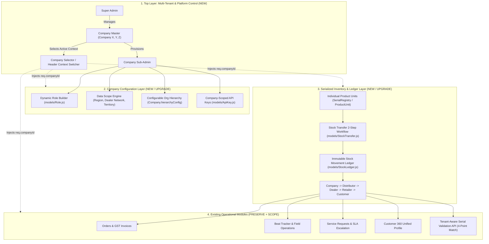

# 🏢 Iconic Smart CRM — Multi-Company Platform Audit & Upgrade Report

**Audit Date:** August 18, 2026  
**Document Version:** 1.0.0  
**Target Architecture:** Multi-Company / Multi-Tenant Configurable CRM Platform  
**Target File Reference:** [MULTI_COMPANY_CRM_FEATURE_AUDIT_REPORT.md](file:///c:/Users/mayur_hlx0x09/Downloads/Iconic-Smart-CRM-main/Iconic-Smart-CRM-main/MULTI_COMPANY_CRM_FEATURE_AUDIT_REPORT.md)

---

## Executive Summary

An in-depth architectural and code-level audit was conducted across the entire **Iconic Smart CRM** codebase (including Node.js/Express backend, MongoDB Mongoose data models, Middleware, Public HTML/JS UI, React Client, and Flutter Mobile App).

### Audit Verdict:
The current codebase has **robust domain foundations** (Sales, Orders, Invoices, Service/SLA, Field Force Beat Tracker, Logistics, Customer 360, Serial Registry, Webhooks, Audit Events). However, the system is currently architected as a **single-tenant CRM**. 

To transform it into a **multi-company configurable CRM platform** without rebuilding the core modules, we need to add a **Tenant Isolation Layer**, **Dynamic Role & Scope Engine**, **Unit-Level Inventory Movement Ledger**, **Multi-Tier Distribution Hierarchy**, and **Tenant-Scoped External Serial Validation APIs**.

---

## 1. Comprehensive Feature Availability & Gap Analysis Matrix

| Feature / Capability | Status | Current Codebase State | Modifications / Upgrades Required |
| :--- | :---: | :--- | :--- |
| **1. Multi-Company / Tenant Isolation** | ❌ **Not Available** | No `Company` model exists. All database collections lack `companyId` / `tenantId`. Super Admin vs Company Admin distinction does not exist. | Create [Company](file:///c:/Users/mayur_hlx0x09/Downloads/Iconic-Smart-CRM-main/Iconic-Smart-CRM-main/models/Company.js) model. Add `companyId` across all operational models. Implement tenant middleware to enforce data scoping and eliminate cross-tenant leakage. |
| **2. Super Admin & Company Selector** | ❌ **Not Available** | Current admins have global access to single flat dataset. No platform-wide company switcher or header tenant context. | Build Super Admin platform dashboard, company switcher UI in header, and pass `X-Company-ID` context to backend API endpoints. |
| **3. Super Admin vs Company Sub-Admin RBAC** | ⚠️ **Partial** | Predefined static roles exist (`admin`, `manager`, `sales`, `user` in [models/User.js](file:///c:/Users/mayur_hlx0x09/Downloads/Iconic-Smart-CRM-main/Iconic-Smart-CRM-main/models/User.js)). | Introduce `super-admin` (global platform owner) and `company-admin` (tenant sub-admin). Scope company sub-admins strictly to their company. |
| **4. Dynamic Role Builder & Scopes** | ❌ **Not Available** | Hardcoded permissions dictionary in [middleware/rbac.js](file:///c:/Users/mayur_hlx0x09/Downloads/Iconic-Smart-CRM-main/Iconic-Smart-CRM-main/middleware/rbac.js). No DB-backed `Role` model or data scope engine. | Create [Role](file:///c:/Users/mayur_hlx0x09/Downloads/Iconic-Smart-CRM-main/Iconic-Smart-CRM-main/models/Role.js) model. Decouple Permission (*what*) from Scope (*which data* e.g., Region, Territory, Dealer Network). Build dynamic Role Builder UI. |
| **5. Configurable Organization Structure** | ❌ **Not Available** | Organization structure is static and hardcoded into logic. | Store company-specific hierarchy in `Company.hierarchyConfig` (e.g. Zone/Region $\rightarrow$ State Manager $\rightarrow$ Distributor $\rightarrow$ Dealer $\rightarrow$ Retailer). |
| **6. Individual Product-Unit Tracking** | ⚠️ **Partial** | Basic [SerialRegistry.js](file:///c:/Users/mayur_hlx0x09/Downloads/Iconic-Smart-CRM-main/Iconic-Smart-CRM-main/models/SerialRegistry.js) exists with status/dealerCode, but lacks unit-level holder state, `companyId`, and QR code bindings. | Upgrade `SerialRegistry` / `ProductUnit` to track: `companyId`, `materialCode`, `serialNumber`, `qrCode`, `currentHolderType` (`COMPANY`, `DISTRIBUTOR`, `DEALER`, `RETAILER`, `CUSTOMER`), `currentHolderId`, and unit state. |
| **7. Multi-Tier Stock Movement Ledger** | ❌ **Not Available** | System only tracks order quantities and dispatch deliveries. No unit-by-unit transfer ledger (Company $\rightarrow$ Distributor $\rightarrow$ Dealer $\rightarrow$ Retailer $\rightarrow$ Customer). | Create [StockTransfer](file:///c:/Users/mayur_hlx0x09/Downloads/Iconic-Smart-CRM-main/Iconic-Smart-CRM-main/models/StockTransfer.js) and [StockLedger](file:///c:/Users/mayur_hlx0x09/Downloads/Iconic-Smart-CRM-main/Iconic-Smart-CRM-main/models/StockLedger.js) models. Implement 2-step transfer workflow (Initiate $\rightarrow$ Accept $\rightarrow$ Ledger update). |
| **8. Tenant-Aware External Serial Validation API** | ⚠️ **Partial** | `/api/v1/serial-validation` exists in [routes/externalSerialValidation.js](file:///c:/Users/mayur_hlx0x09/Downloads/Iconic-Smart-CRM-main/Iconic-Smart-CRM-main/routes/externalSerialValidation.js), but queries globally by serial number without `companyId`. | Scope validation strictly to: `{ companyId, materialCode, serialNumber, dealerCode }`. Attach `companyId` to `ApiKey` so Company X cannot validate Company Y's serials. |
| **9. Company-Scoped API Keys** | ⚠️ **Partial** | [models/ApiKey.js](file:///c:/Users/mayur_hlx0x09/Downloads/Iconic-Smart-CRM-main/Iconic-Smart-CRM-main/models/ApiKey.js) exists with rate limits & dealerScope, but has no `companyId` binding. | Add `companyId` field to `ApiKey` model and validate company ownership in [middleware/apiKeyAuth.js](file:///c:/Users/mayur_hlx0x09/Downloads/Iconic-Smart-CRM-main/Iconic-Smart-CRM-main/middleware/apiKeyAuth.js). |
| **10. Sales, Orders & GST Invoicing** | ✅ **Available (Preserve)** | [routes/orders.js](file:///c:/Users/mayur_hlx0x09/Downloads/Iconic-Smart-CRM-main/Iconic-Smart-CRM-main/routes/orders.js), [routes/invoices.js](file:///c:/Users/mayur_hlx0x09/Downloads/Iconic-Smart-CRM-main/Iconic-Smart-CRM-main/routes/invoices.js), PDF generation fully functional. | Preserve business logic; add `companyId` scoping to all order and invoice queries. |
| **11. Field Force & Beat Tracker** | ✅ **Available (Preserve)** | [routes/beatTracker.js](file:///c:/Users/mayur_hlx0x09/Downloads/Iconic-Smart-CRM-main/Iconic-Smart-CRM-main/routes/beatTracker.js), GPS check-ins, selfie store visits, monthly targets, Flutter app. | Preserve full functionality; scope visits and attendance by `companyId`. |
| **12. Service Management & SLAs** | ✅ **Available (Preserve)** | [routes/serviceRequests.js](file:///c:/Users/mayur_hlx0x09/Downloads/Iconic-Smart-CRM-main/Iconic-Smart-CRM-main/routes/serviceRequests.js), [services/slaService.js](file:///c:/Users/mayur_hlx0x09/Downloads/Iconic-Smart-CRM-main/Iconic-Smart-CRM-main/services/slaService.js), Service Center routing. | Preserve full functionality; scope tickets and service centers by `companyId`. |
| **13. Customer 360 Profile** | ✅ **Available (Preserve)** | [services/customer360Service.js](file:///c:/Users/mayur_hlx0x09/Downloads/Iconic-Smart-CRM-main/Iconic-Smart-CRM-main/services/customer360Service.js) aggregates orders, warranties, service tickets. | Add `companyId` filter to aggregate data strictly within active company. |
| **14. Webhooks & Audit Events** | ✅ **Available (Preserve)** | [models/Webhook.js](file:///c:/Users/mayur_hlx0x09/Downloads/Iconic-Smart-CRM-main/Iconic-Smart-CRM-main/models/Webhook.js), [models/AuditEvent.js](file:///c:/Users/mayur_hlx0x09/Downloads/Iconic-Smart-CRM-main/Iconic-Smart-CRM-main/models/AuditEvent.js), HMAC signatures. | Add `companyId` to isolate webhooks and audit trails per company. |

---

## 2. Detailed Technical Breakdown: What Needs to be Built, Modified, & Preserved



---

## 3. What Needs to be Created (NEW Components)

### 3.1. `Company` Model & Platform Management
* **File:** `models/Company.js`
* **Attributes:**
  * `name`, `code` (e.g. `COMP_X`, `COMP_Y`), `logo`, `isActive`
  * `hierarchyConfig`: Custom organizational tree structure (Zones, Regions, Territories, Tiers).
  * `settings`: Custom GST rates, invoice prefixes, warranty policies, SLA defaults.
  * `primaryAdmin`: Reference to the initial Company Sub-Admin user.
* **Routes:** `routes/companies.js` (Super Admin endpoints for CRUD, activation, and company switching).

### 3.2. Dynamic `Role` Model & Permission/Scope Engine
* **File:** `models/Role.js`
* **Attributes:**
  * `companyId`: Reference to Company.
  * `name`: e.g. "Senior Sales Manager", "Distributor Manager", "Regional Service Lead".
  * `permissions`: Array of granular permission strings (e.g., `sales.view`, `sales.create`, `inventory.transfer`, `reports.export`).
  * `scopeType`: `'ALL' | 'REGION' | 'TERRITORY' | 'DEALER_NETWORK' | 'OWN'`.
  * `scopeValues`: Array of permitted regions/dealer codes.
* **Routes:** `routes/roles.js` (Company Sub-Admin dynamic role management).

### 3.3. Multi-Tier Stock Transfer & Movement Ledger
* **Files:** `models/StockTransfer.js` & `models/StockLedger.js`
* **Workflow:**
  1. Sender initiates transfer of specific serial numbers/unit IDs to a recipient (Distributor, Dealer, or Retailer).
  2. Status set to `PENDING`. Source units marked as `IN_TRANSIT`.
  3. Recipient accepts or rejects the transfer.
  4. On acceptance: Unit holder updated (`currentHolderType`, `currentHolderId`), inventory balances updated, immutable audit record written to `StockLedger`.

### 3.4. Tenant Context & Isolation Middleware
* **File:** `middleware/tenant.js`
* **Functionality:**
  * Identifies active tenant from `req.headers['x-company-id']`, JWT claims, or Super Admin context.
  * Injects `req.companyId` into all route handlers.
  * Validates that non-super-admin users cannot access or query data outside their assigned `companyId`.

---

## 4. What Needs to be Modified / Upgraded (EXISTING Components)

### 4.1. `models/User.js` & Auth Middleware
* **Modifications:**
  * Add `companyId: { type: mongoose.Schema.Types.ObjectId, ref: 'Company' }` (optional for Super Admin, required for all other users).
  * Add `customRoleId: { type: mongoose.Schema.Types.ObjectId, ref: 'Role' }`.
  * Update `role` enum to include `super-admin` and `company-admin`.
  * Update JWT payload in [routes/auth.js](file:///c:/Users/mayur_hlx0x09/Downloads/Iconic-Smart-CRM-main/Iconic-Smart-CRM-main/routes/auth.js) to embed `companyId` and role permissions.

### 4.2. `models/SerialRegistry.js` & Serial Validation Service
* **Modifications in [models/SerialRegistry.js](file:///c:/Users/mayur_hlx0x09/Downloads/Iconic-Smart-CRM-main/Iconic-Smart-CRM-main/models/SerialRegistry.js):**
  * Add `companyId: { type: mongoose.Schema.Types.ObjectId, ref: 'Company', required: true, index: true }`.
  * Add `qrCode`, `materialCode`, `currentHolderType` (`COMPANY`, `DISTRIBUTOR`, `DEALER`, `RETAILER`, `CUSTOMER`), `currentHolderId`.
  * Change unique compound index from `{ materialCode: 1, serialNumber: 1 }` to `{ companyId: 1, materialCode: 1, serialNumber: 1 }` to permit same serials across distinct companies if needed.
* **Modifications in [services/serialValidationService.js](file:///c:/Users/mayur_hlx0x09/Downloads/Iconic-Smart-CRM-main/Iconic-Smart-CRM-main/services/serialValidationService.js):**
  * Enforce strict 4-point verification query:
    $$\text{find} \big( \{ \text{companyId}, \text{materialCode}, \text{serialNumber}, \text{dealerCode} \} \big)$$
  * Eliminate global non-tenant queries.

### 4.3. `models/ApiKey.js` & API Key Middleware
* **Modifications:**
  * Add `companyId: { type: mongoose.Schema.Types.ObjectId, ref: 'Company', required: true, index: true }`.
  * In [middleware/apiKeyAuth.js](file:///c:/Users/mayur_hlx0x09/Downloads/Iconic-Smart-CRM-main/Iconic-Smart-CRM-main/middleware/apiKeyAuth.js), resolve the API Key's `companyId` and attach it to `req.companyId`.

### 4.4. All Operational Collections (Tenant Scoping)
* **Models to update with `companyId`:**
  * [models/Product.js](file:///c:/Users/mayur_hlx0x09/Downloads/Iconic-Smart-CRM-main/Iconic-Smart-CRM-main/models/Product.js)
  * [models/Order.js](file:///c:/Users/mayur_hlx0x09/Downloads/Iconic-Smart-CRM-main/Iconic-Smart-CRM-main/models/Order.js)
  * [models/Retailer.js](file:///c:/Users/mayur_hlx0x09/Downloads/Iconic-Smart-CRM-main/Iconic-Smart-CRM-main/models/Retailer.js) (Distributors, Dealers, Retailers)
  * [models/ServiceRequest.js](file:///c:/Users/mayur_hlx0x09/Downloads/Iconic-Smart-CRM-main/Iconic-Smart-CRM-main/models/ServiceRequest.js)
  * [models/ServiceCenter.js](file:///c:/Users/mayur_hlx0x09/Downloads/Iconic-Smart-CRM-main/Iconic-Smart-CRM-main/models/ServiceCenter.js)
  * [models/StoreVisit.js](file:///c:/Users/mayur_hlx0x09/Downloads/Iconic-Smart-CRM-main/Iconic-Smart-CRM-main/models/StoreVisit.js)
  * [models/Attendance.js](file:///c:/Users/mayur_hlx0x09/Downloads/Iconic-Smart-CRM-main/Iconic-Smart-CRM-main/models/Attendance.js)
  * [models/Dispatch.js](file:///c:/Users/mayur_hlx0x09/Downloads/Iconic-Smart-CRM-main/Iconic-Smart-CRM-main/models/Dispatch.js)
  * [models/Lead.js](file:///c:/Users/mayur_hlx0x09/Downloads/Iconic-Smart-CRM-main/Iconic-Smart-CRM-main/models/Lead.js)
  * [models/Contact.js](file:///c:/Users/mayur_hlx0x09/Downloads/Iconic-Smart-CRM-main/Iconic-Smart-CRM-main/models/Contact.js)
  * [models/Opportunity.js](file:///c:/Users/mayur_hlx0x09/Downloads/Iconic-Smart-CRM-main/Iconic-Smart-CRM-main/models/Opportunity.js)
  * [models/MarketingAsset.js](file:///c:/Users/mayur_hlx0x09/Downloads/Iconic-Smart-CRM-main/Iconic-Smart-CRM-main/models/MarketingAsset.js)
  * [models/Webhook.js](file:///c:/Users/mayur_hlx0x09/Downloads/Iconic-Smart-CRM-main/Iconic-Smart-CRM-main/models/Webhook.js)
  * [models/AuditEvent.js](file:///c:/Users/mayur_hlx0x09/Downloads/Iconic-Smart-CRM-main/Iconic-Smart-CRM-main/models/AuditEvent.js)

### 4.5. Frontend Shell & Navigation
* **Enhancements:**
  * Add Company Switcher dropdown to the top navigation header for Super Admins.
  * Update API client wrappers (in Vanilla JS and React) to pass the active `X-Company-ID` header.
  * Add Super Admin view (Company onboarding, company activation, platform health) and Company Sub-Admin view (Dynamic Role builder, hierarchy config, stock transfers).

---

## 5. What Stays Untouched & Preserved (DO NOT REBUILD)

1. **GST Calculation Engine & PDF Invoice Generator**: Core tax and invoice layout in [routes/invoices.js](file:///c:/Users/mayur_hlx0x09/Downloads/Iconic-Smart-CRM-main/Iconic-Smart-CRM-main/routes/invoices.js) stays intact.
2. **Order Lifecycle State Machine**: (`pending` $\rightarrow$ `confirmed` $\rightarrow$ `processing` $\rightarrow$ `dispatched` $\rightarrow$ `delivered` $\rightarrow$ `completed`).
3. **Field Force GPS Attendance & Selfie Verification**: Anti-fraud selfie capture and GPS location verification in [routes/beatTracker.js](file:///c:/Users/mayur_hlx0x09/Downloads/Iconic-Smart-CRM-main/Iconic-Smart-CRM-main/routes/beatTracker.js) remain intact.
4. **SLA Timers & Priority Escalation Matrix**: Auto-escalation and breach timers in [services/slaService.js](file:///c:/Users/mayur_hlx0x09/Downloads/Iconic-Smart-CRM-main/Iconic-Smart-CRM-main/services/slaService.js) remain intact.
5. **Customer 360 Aggregation Engine**: Core aggregation logic in [services/customer360Service.js](file:///c:/Users/mayur_hlx0x09/Downloads/Iconic-Smart-CRM-main/Iconic-Smart-CRM-main/services/customer360Service.js) remains intact.
6. **Cross-Platform Mobile App (Flutter)**: Flutter client remains intact; only needs to receive `companyId` upon authentication.

---

## 6. Implementation Phasing Recommendation

```
Phase 1: Multi-Tenant Architecture & Company Model
  ├── 1.1 Create Company Model & Super Admin routes
  ├── 1.2 Implement Tenant Isolation Middleware (req.companyId)
  └── 1.3 Add companyId to all Mongoose models & compound indexes

Phase 2: Dynamic RBAC & Organization Hierarchy
  ├── 2.1 Create dynamic Role model & Scoping engine
  ├── 2.2 Upgrade User model (Super Admin vs Company Sub-Admin)
  └── 2.3 Build Company Structure & Role Builder UI

Phase 3: Serialized Product Units & Multi-Tier Stock Ledger
  ├── 3.1 Upgrade SerialRegistry to full unit state machine (ProductUnit)
  ├── 3.2 Create StockTransfer & StockLedger models
  └── 3.3 Implement 2-step Transfer workflow (Company -> Dist -> Dealer -> Retailer)

Phase 4: Tenant-Aware External APIs & Keys
  ├── 4.1 Bind ApiKey model to Company
  └── 4.2 Upgrade /api/v1/serial-validation to strict 4-point verification

Phase 5: Frontend Shell & Context Switcher
  ├── 5.1 Super Admin platform dashboard & Company switcher header
  └── 5.2 Company Admin management interfaces

Phase 6: End-to-End Testing & Security Regression
  ├── 6.1 Multi-tenant data leakage tests (Company X vs Company Y)
  └── 6.2 Full workflow verification (Transfer -> Sale -> Validation)
```

---
*Report generated and committed to the workspace root at `MULTI_COMPANY_CRM_FEATURE_AUDIT_REPORT.md`.*
